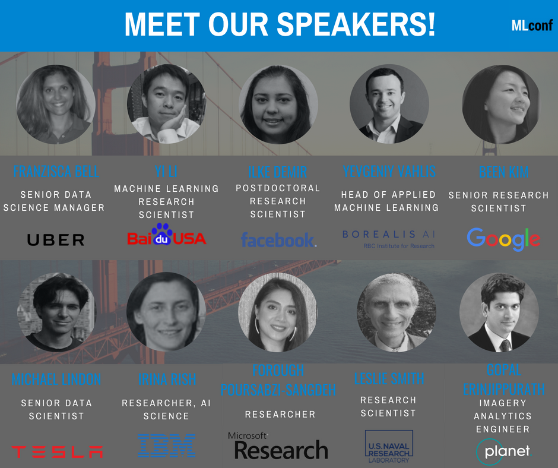

# MLConf SF 2018

## Date / Location
- November 14, 2018
- Hotel Nikko, 222 Mason Street, San Francisco, CA 94102

## About
This single-day, single-track event will host a variety of relevant presentations of today’s application of machine learning techniques and algorithms from experts from Google Brain, Uber, Facebook, Baidu, Tesla, & More. The event will host presentations on novel applications of machine learning within real-world arenas such as: geospatial data, cancer metastasis detection, various NLP challenges, and more to be announced soon.

## Event Website
https://mlconf.com/events/mlconf-sf-2018/

## Ticketing Site
https://www.eventbrite.com/e/mlconf-sf-2018-tickets-45989163827

## Discounts
18% off:  
https://www.eventbrite.com/e/mlconf-sf-2018-tickets-45989163827?discount=WiMLDSNNY18

## Student Discounts
https://goo.gl/forms/wQkwhNCNdB4hlMp23

## Volunteering Opportunities
email volunteers@mlconf.com

## Application for Free Pass
https://goo.gl/forms/RfP8AHctZWlF090f2

## Current Speakers
- Been Kim, Research Scientist, Google Brain
- Yevgeniy Vahlis, Head of Applied ML Research, Borealis AI
- Franziska Bell, Senior Data Science Manager on the Platform Team, Uber
- Yi Li, Research Scientist, Baidu
- Ilke Demir, Postdoctoral Researcher, Facebook
- Michael Lindon, Senior Data Scientist, Tesla
- Irina Rish, Researcher, The AI Foundations- Department of the IBM T.J. Watson Research Center
- **Dr. Leslie Smith, Senior Research Scientist, US Naval Research Laboratory**
- Forough Poursabzi-Sangdeh, Postdoctoral Researcher, Microsoft
- Gopal Erinjippurath, Director, Analytics Engineering, Planet Inc

